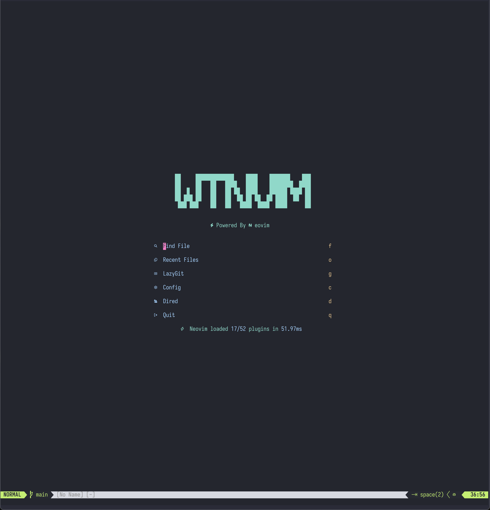

# Neovim Configuration

> [!NOTE]
> it will be update date by date, since I will do some change that during my daily use.

## Info

I start with [kickstart] and [NvChad UI] to configure my personal [Neovim] setting. If you would like to use my configuration, you can clone it and follow the command below. Feel free to use it and make the issue or PRs.

## MyNeovim




### Architecture & Structure

Modular Design:

- init.lua → core/ → plugins/ flow
- Each plugin has its own configuration file

Core Organization:

- core/ - Basic Neovim settings and keymaps
- lsp/ - Language server configurations
- plugins/ - Plugin specifications and configs
- snippets/ - Language-specific code snippets

Plugin Management:

- Uses lazy.nvim for lazy loading
- Individual plugin configs in plugins/configs/
- Cross-platform compatibility (Windows and Mac)

### Config

You can find more detail [here](./structure.md)

### Plugin Ecosystem

**Essential Tools:**

- File Management: Oil, NeoTree
- Fuzzy Finding: fzr-Lua
- LSP: Full setup with Mason, blink.cmp completion
- Git Integration: Gitsigns, Octo, lazygit
- AI Tools: Copilot + ClaudeCode integration
- Spell check with fastspel

## Setup

**Requirements**

- Neovim >= 0.11
- git
- fzf
- ripgrep
- fd || fdfind
- lazygit `option`

**Getting Started**

```bash
# remove the old Neovim configuration
rm -rf ~/.config/nvim
rm -rf ~/.local/state/nvim
rm -rf ~/.local/share/nvim

# install and clone
git clone https://github.com/WeiTing1991/myDotfiles.git ~/.config/nvim-temp
cp -r ~/.config/nvim-temp/.config/nvim ~/.config/nvim
rm -rf ~/.config/nvim-temp
```

```powershell
# Windows PowerShell - remove old Neovim configuration
Remove-Item -Recurse -Force "$env:LOCALAPPDATA\nvim" -ErrorAction SilentlyContinue
Remove-Item -Recurse -Force "$env:LOCALAPPDATA\nvim-data" -ErrorAction SilentlyContinue

# install and clone
git clone https://github.com/WeiTing1991/myDotfiles.git "$env:LOCALAPPDATA\nvim-temp"
Copy-Item -Recurse "$env:LOCALAPPDATA\nvim-temp\.config\nvim" "$env:LOCALAPPDATA\nvim"
Remove-Item -Recurse -Force "$env:LOCALAPPDATA\nvim-temp"
```

> In Neovim run `:MasonToolInstallSync` to install LSP, linter, and formater

### Keybindings

The main core keymaps is in `core/keymaps`, it has basic neovim motion and some useful keymaps
The LSP keymaps is in `lsp\keymaps`, it is all about lsp stuffs.
The custom keymaps is under root folder `user_keymaps`, it contains user override and the plugins keymaps.

Detailed keybinding documentation: [Neovim Keymaps Guide](./keybindings.md)

## Plugins

You can find all the plugins, I currently use [here](./plugins.md)

### **Package Manager**

- [lazy.nvim](https://github.com/folke/lazy.nvim) - Modern plugin manager with lazy loading

### **Core & UI**

- [nvchad/ui](https://github.com/nvchad/ui) - NvChad UI components
- [nvchad/base46](https://github.com/nvchad/base46) - Theme management

### **Navigation & File Management**

- [oil.nvim](https://github.com/stevearc/oil.nvim) - Edit your filesystem like a buffer
- [fzf-lua](https://github.com/ibhagwan/fzf-lua) - Fast fuzzy finder
- [neo-tree.nvim](https://github.com/nvim-neo-tree/neo-tree.nvim) - File explorer tree

### **LSP & Language Support**

- [neovim/nvim-lspconfig](https://github.com/neovim/nvim-lspconfig) - Language server configurations
- [williamboman/mason.nvim](https://github.com/williamboman/mason.nvim) - Language server installer
- [WeiTing1991/none-ls.nvim](https://github.com/WeiTing1991/none-ls.nvim) - Formatter/linter integration (forked)

### **Autocompletion & Snippets**

- [saghen/blink.cmp](https://github.com/saghen/blink.cmp) - Fast completion engine
- [L3MON4D3/LuaSnip](https://github.com/L3MON4D3/LuaSnip) - Snippet engine

### **Git Integration**

- [lewis6991/gitsigns.nvim](https://github.com/lewis6991/gitsigns.nvim) - Git decorations and hunks
- [pwntester/octo.nvim](https://github.com/pwntester/octo.nvim) - GitHub integration
- [kdheepak/lazygit.nvim](https://github.com/kdheepak/lazygit.nvim) - LazyGit integration
- [sindrets/diffview.nvim](https://github.com/sindrets/diffview.nvim) - Git diff viewer

### **AI Tools**

- [zbirenbaum/copilot.lua](https://github.com/zbirenbaum/copilot.lua) - GitHub Copilot integration
- [folke/sidekick.nvim](https://github.com/folke/sidekick.nvim) - Claude Code integration

### **Language Support Status**

- [x] C/C++
- [x] C#
- [x] Python
- [x] Lua
- [ ] JavaScript/TypeScript (partial)
- [ ] Go
- [ ] Java

## Features

- [ ] Debugger
- [ ] Better tab view
- [ ] Better Markdown preview

[kickstart]: https://github.com/nvim-lua/kickstart.nvim
[Neovim]: https://neovim.io/
[GNU stow]: https://www.gnu.org/software/stow/manual/stow.html
[NvChad UI]: https://nvchad.com/
