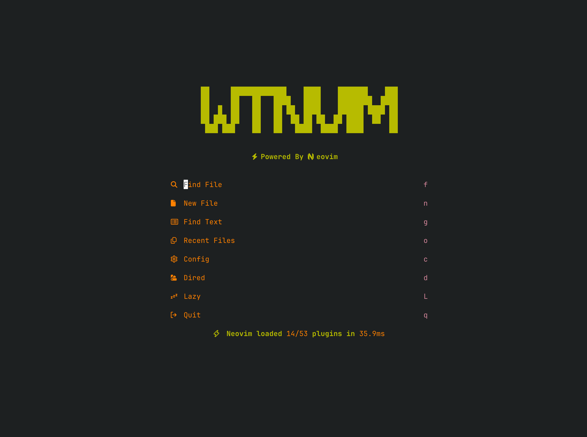

# Neovim Configuration

<a href="https://dotfyle.com/WeiTing1991/mydotfiles-config-nvim"></a>
<a href="https://dotfyle.com/WeiTing1991/mydotfiles-config-nvim"></a>
<a href="https://dotfyle.com/WeiTing1991/mydotfiles-config-nvim"></a>


> [!NOTE]
> it will be update date by date, since I will do some change that during my daily use.

## Info

I start with [kickstart] and [NvChad UI] to configure my personal [Neovim] setting. If you would like to use my configuration, you can clone it and follow the command below. Feel free to use it and make ths issue or PRs.
<!-- Lazy build fastspell.nvim -->


## MyNeovim



  Architecture & Structure

  - Modular Design: Clean separation with init.lua → core/ → plugin/ structure
  - VSCode Integration: Conditional loading for VSCode extension (vs_user/)
  - Lazy Loading: Uses lazy.nvim for efficient plugin management

  Core Configuration

  - Leader Keys: Space (primary) and comma (local leader)
  - Shell Configuration: Windows-optimized (cmd.exe/pwsh.exe)
  - Performance: Disabled unnecessary providers, optimized startup time tracking
  - Options: Well-configured with 2-space indentation, smart search, treesitter folding

  Plugin Ecosystem
  Essential Tools:
  - File Management: Oil.nvim, NvimTree
  - Fuzzy Finding: Telescope with multiple pickers
  - LSP: Full setup with Mason, blink.cmp completion
  - Git Integration: Gitsigns, fugitive-style commands
  - AI Tools: Copilot + ClaudeCode integration

  UI Enhancements:
  - Theme: Custom "bella-gruvbox" colorscheme
  - Dashboard: Snacks.nvim with custom ASCII art
  - Status: Lualine configuration

   Cross-platform compatibility (Windows/Mac/Linux)
   AI-assisted workflow with multiple tools
	 Performance-conscious configuration

  <!-- Areas for Improvement -->
  <!-- - Some commented-out keybindings could be cleaned up (.config/nvim/lua/userkeymaps.lua:52-115) -->
  <!-- - Duplicate buffer navigation keymaps (.config/nvim/lua/core/keymaps.lua:17-18 vs .config/nvim/lua/userkeymaps.lua:24-25) -->
  <!-- - Consider consolidating git-related keymaps (.config/nvim/lua/userkeymaps.lua:69-72) -->

## Setup
**Requirements**
- Neovim >= 0.11
- git >= 2.47.1
- curl
- fzf
- ripgrep
- fd || fdfind
- lazygit `option`

**Getting Started**
```bash
# remove the old Neovim configuration
rm -rf ~/.config/nvim
rm -rf ~/.local/state/nvim
rm -rf ~/.local/share/nvim
# install and clone
git clone  https://github.com/WeiTing1991/myDotfiles/tree/main/.config/nvim ~/.config/nvim
```

```powershell
rm -Force ~\AppData\Local\nvim
rm -Force ~\AppData\Local\nvim-data
```
> In Neovim run `:MasonToolInstall` to install the extra(linter and formater).

## Config

> [!NOTE]
> Still under documenting

## Install Instructions

 > Install requires Neovim 0.9+. Always review the code before installing a configuration.

Clone the repository and install the plugins:

```sh
git clone git@github.com:WeiTing1991/myDotfiles ~/.config/WeiTing1991/myDotfiles
```

Open Neovim with this config:

```sh
NVIM_APPNAME=WeiTing1991/myDotfiles/.config/nvim nvim
```
## Plugins

### ai
### Theme

### bars-and-lines
+ [luukvbaal/statuscol.nvim](https://dotfyle.com/plugins/luukvbaal/statuscol.nvim)
+ [lukas-reineke/virt-column.nvim](https://dotfyle.com/plugins/lukas-reineke/virt-column.nvim)
### code-runner

+ [stevearc/overseer.nvim](https://dotfyle.com/plugins/stevearc/overseer.nvim)
### color

+ [catgoose/nvim-colorizer.lua](https://dotfyle.com/plugins/catgoose/nvim-colorizer.lua)
### comment

+ [folke/todo-comments.nvim](https://dotfyle.com/plugins/folke/todo-comments.nvim)
+ [danymat/neogen](https://dotfyle.com/plugins/danymat/neogen)
+ [numToStr/Comment.nvim](https://dotfyle.com/plugins/numToStr/Comment.nvim)
+ [JoosepAlviste/nvim-ts-context-commentstring](https://dotfyle.com/plugins/JoosepAlviste/nvim-ts-context-commentstring)
### completion

+ [zbirenbaum/copilot.lua](https://dotfyle.com/plugins/zbirenbaum/copilot.lua)
### debugging

+ [mfussenegger/nvim-dap](https://dotfyle.com/plugins/mfussenegger/nvim-dap)
+ [rcarriga/nvim-dap-ui](https://dotfyle.com/plugins/rcarriga/nvim-dap-ui)
+ [theHamsta/nvim-dap-virtual-text](https://dotfyle.com/plugins/theHamsta/nvim-dap-virtual-text)
### diagnostics

+ [folke/trouble.nvim](https://dotfyle.com/plugins/folke/trouble.nvim)
### editing-support

+ [echasnovski/mini.ai](https://dotfyle.com/plugins/echasnovski/mini.ai)
+ [windwp/nvim-autopairs](https://dotfyle.com/plugins/windwp/nvim-autopairs)
+ [Wansmer/treesj](https://dotfyle.com/plugins/Wansmer/treesj)
+ [windwp/nvim-ts-autotag](https://dotfyle.com/plugins/windwp/nvim-ts-autotag)
+ [nvim-treesitter/nvim-treesitter-context](https://dotfyle.com/plugins/nvim-treesitter/nvim-treesitter-context)
### file-explorer

+ [nvim-tree/nvim-tree.lua](https://dotfyle.com/plugins/nvim-tree/nvim-tree.lua)
+ [echasnovski/mini.files](https://dotfyle.com/plugins/echasnovski/mini.files)
+ [stevearc/oil.nvim](https://dotfyle.com/plugins/stevearc/oil.nvim)
### formatting

+ [stevearc/conform.nvim](https://dotfyle.com/plugins/stevearc/conform.nvim)
### fuzzy-finder

+ [ibhagwan/fzf-lua](https://dotfyle.com/plugins/ibhagwan/fzf-lua)
### git

+ [sindrets/diffview.nvim](https://dotfyle.com/plugins/sindrets/diffview.nvim)
+ [lewis6991/gitsigns.nvim](https://dotfyle.com/plugins/lewis6991/gitsigns.nvim)
+ [NeogitOrg/neogit](https://dotfyle.com/plugins/NeogitOrg/neogit)
### icon

+ [nvim-tree/nvim-web-devicons](https://dotfyle.com/plugins/nvim-tree/nvim-web-devicons)
### indent

+ [lukas-reineke/indent-blankline.nvim](https://dotfyle.com/plugins/lukas-reineke/indent-blankline.nvim)
+ [echasnovski/mini.indentscope](https://dotfyle.com/plugins/echasnovski/mini.indentscope)
### keybinding

+ [echasnovski/mini.clue](https://dotfyle.com/plugins/echasnovski/mini.clue)
### lsp

+ [neovim/nvim-lspconfig](https://dotfyle.com/plugins/neovim/nvim-lspconfig)
+ [nvimtools/none-ls.nvim](https://dotfyle.com/plugins/nvimtools/none-ls.nvim)
+ [stevearc/aerial.nvim](https://dotfyle.com/plugins/stevearc/aerial.nvim)
+ [rmagatti/goto-preview](https://dotfyle.com/plugins/rmagatti/goto-preview)
+ [j-hui/fidget.nvim](https://dotfyle.com/plugins/j-hui/fidget.nvim)
### lsp-installer

+ [williamboman/mason.nvim](https://dotfyle.com/plugins/williamboman/mason.nvim)
### markdown-and-latex

+ [iamcco/markdown-preview.nvim](https://dotfyle.com/plugins/iamcco/markdown-preview.nvim)
+ [MeanderingProgrammer/render-markdown.nvim](https://dotfyle.com/plugins/MeanderingProgrammer/render-markdown.nvim)
### media

+ [HakonHarnes/img-clip.nvim](https://dotfyle.com/plugins/HakonHarnes/img-clip.nvim)
### note-taking

+ [nvim-orgmode/orgmode](https://dotfyle.com/plugins/nvim-orgmode/orgmode)
### nvim-dev

+ [MunifTanjim/nui.nvim](https://dotfyle.com/plugins/MunifTanjim/nui.nvim)
+ [jbyuki/one-small-step-for-vimkind](https://dotfyle.com/plugins/jbyuki/one-small-step-for-vimkind)
+ [folke/lazydev.nvim](https://dotfyle.com/plugins/folke/lazydev.nvim)
+ [nvim-lua/plenary.nvim](https://dotfyle.com/plugins/nvim-lua/plenary.nvim)
### plugin-manager

+ [folke/lazy.nvim](https://dotfyle.com/plugins/folke/lazy.nvim)
### programming-languages-support

+ [akinsho/flutter-tools.nvim](https://dotfyle.com/plugins/akinsho/flutter-tools.nvim)
+ [iabdelkareem/csharp.nvim](https://dotfyle.com/plugins/iabdelkareem/csharp.nvim)
### search

+ [MagicDuck/grug-far.nvim](https://dotfyle.com/plugins/MagicDuck/grug-far.nvim)
### snippet

+ [L3MON4D3/LuaSnip](https://dotfyle.com/plugins/L3MON4D3/LuaSnip)
+ [rafamadriz/friendly-snippets](https://dotfyle.com/plugins/rafamadriz/friendly-snippets)
### statusline

+ [tamton-aquib/staline.nvim](https://dotfyle.com/plugins/tamton-aquib/staline.nvim)
+ [rebelot/heirline.nvim](https://dotfyle.com/plugins/rebelot/heirline.nvim)
### syntax

+ [kylechui/nvim-surround](https://dotfyle.com/plugins/kylechui/nvim-surround)
+ [nvim-treesitter/nvim-treesitter](https://dotfyle.com/plugins/nvim-treesitter/nvim-treesitter)
+ [nvim-treesitter/nvim-treesitter-textobjects](https://dotfyle.com/plugins/nvim-treesitter/nvim-treesitter-textobjects)
### utility

+ [stevearc/dressing.nvim](https://dotfyle.com/plugins/stevearc/dressing.nvim)
+ [kevinhwang91/nvim-ufo](https://dotfyle.com/plugins/kevinhwang91/nvim-ufo)

**Core**

**UI**

**Package manager**
- [lazy.nvim](https://github.com/folke/lazy.nvim) - no question! From folke.

**Navigation**
<!-- - [telescope](https://github.com/nvim-telescope/telescope.nvim) - fuzzy finder, it needs [ripgrep] and [fd]. -->
- [oil](https://github.com/stevearc/oil.nvim) - really useful for creating and modifying files as normal buffer. It is really similar to Dired in Emacs.

**Treesitter&Lsp**
- [treesitter](https://github.com/nvim-treesitter/nvim-treesitter)

**Editor tool**
  <!-- - [todo-comments](): -->
  - [indent-blankline]():
  - [mini.indentscope]():
  - [virt-column]():
  - [comment]():
  - [mini.pairs]():
  - [mini.ai]():

**Misc**
  - [gitsigns](https://github.com/lewis6991/gitsigns.nvim) -
  - [copilot.lua](https://github.com/zbirenbaum/copilot.lua)
  - [trouble](https://github.com/folke/trouble.nvim)

**Note taking**
<!--   - [render markdown](https://github.com/MeanderingProgrammer/render-markdown.nvim) -->
<!--   - [markdown-preview](https://github.com/iamcco/markdown-preview.nvim) -->
<!---->

**Support Language**

  - [ ]  C/C++ `- extra plugins`
	- [x]  C#
  - [x]  Python
  - [x]  JavaScript/Typescript
  - [ ]  Go
  - [ ]  Java

## Language Servers

+ bashls
+ clangd
+ cmake
+ cssls
+ docker_compose_language_service
+ dockerls
+ eslint
+ gopls
+ graphql
+ html
+ jdtls
+ jsonls
+ lua_ls
+ marksman
+ omnisharp
+ pyright
+ ruff_lsp
+ svelte
+ tailwindcss
+ taplo
+ tflint
+ yamlls


### Keybindings

More information you can find [here](https://weiting1991.github.io/weitingworks/posts/240927_neovim_setup/).

### LSP

More information you can find [here](https://weiting1991.github.io/weitingworks/posts/240927_neovim_setup/).

### Features

<!-- link -->
[kickstart]: https://github.com/nvim-lua/kickstart.nvim
[Neovim]: https://neovim.io/
[GNU stow]: https://www.gnu.org/software/stow/manual/stow.html
[ripgrep]:
[fd]:

<!-- https://github.com/stevearc/overseer.nvim -->
